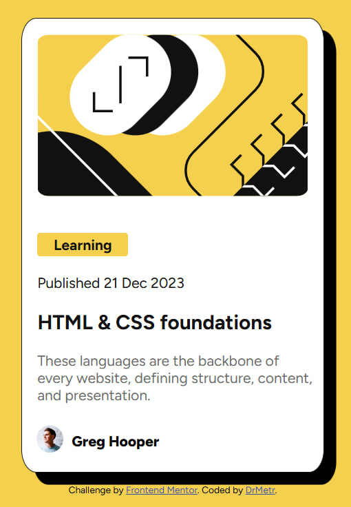

# Frontend Mentor - Blog preview card solution

This is a solution to the [Blog preview card challenge on Frontend Mentor](https://www.frontendmentor.io/challenges/blog-preview-card-ckPaj01IcS). Frontend Mentor challenges help you improve your coding skills by building realistic projects. 

## Table of contents

- [Overview](#overview)
  - [The challenge](#the-challenge)
  - [Screenshot](#screenshot)
  - [Links](#links)
- [My process](#my-process)
  - [Built with](#built-with)
  - [What I learned](#what-i-learned)
  - [Continued development](#continued-development)
  - [Useful resources](#useful-resources)
- [Author](#author)


## Overview

### The challenge

Users should be able to:

- See hover and focus states for all interactive elements on the page

### Screenshot


Alt: https://github.com/DrMetr/challenge-blog-card-html-css/blob/main/screenshot.jpg

### Links

- Solution URL: https://github.com/DrMetr/challenge-blog-card-html-css.git
- Live Site URL: https://drmetr.github.io/challenge-blog-card-html-css/

## My process

### Built with

- Semantic HTML5 markup
- CSS custom properties
- Flexbox
- CSS Grid

### What I learned

The purpose of solving the challenge was to consolidate my html and css skills. I didn't use any major consept that I wasn't privy to before after taking W3 tutorials. There were a couple of little things that I learned in meantime, like what fr is, how to change cursor and that in order to make text responsive one should change font-size from default px to vh. I've also added smooth transition to my taste to the hover state of the h1.

During the development I encountered a problem of attribution footer position: it kept floating at the top of the webpage and float, flex or position properties wouldn't help. I solved the issue with grid after hours of trying to put it back where I wanted it to be. 

Another issue I faced was aligning the avatar and the author's name. Float and flex didn't help again and grid wouldn't position them the way I wanted. While reading a guide on flexbox (https://css-tricks.com/snippets/css/a-guide-to-flexbox/) I noticed that the developers used a way to present attribution similar to the task's layout so I reached the source code and applied it partially to my solution:

```
#author-row {
    display: grid;
    grid-template-columns: 3rem 1fr;
    margin-left: 1vh;
    align-items: center;
}
```
I didn't manage to make the site responsive according to the challenge's design and prioritised desktop design over mobile one. The result is responsive regardless but only to a certain degree.

### Continued development

I struggle the most with float, flex and grid. Becoming more confident with those would reduce my fear of responsive webpage design.

### Useful resources

- [CSS Flexbox Layout Guide] (https://css-tricks.com/snippets/css/a-guide-to-flexbox/) - I really liked this article because it has everything about flexbox collected in one place with good illustrations and I find it helpful for beginners.

## Author

- Website - [DrMetr](https://github.com/DrMetr)
- Frontend Mentor - [@DrMetr](https://www.frontendmentor.io/profile/DrMetr)